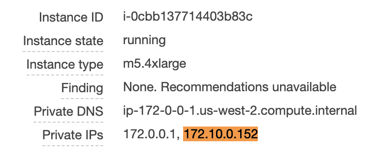

# Deploying

Ensure credentials in your default profile are refreshed and ready to go, then deploy AWS resources with the [deploy.sh](../core-components/deploy.sh)
script:
* This script will create a temporary build directory containing all required variables, then initialize Terraform and run.
* The command (`-m` option) should generally be set to `plan` first, to review [what will be deployed](https://www.terraform.io/docs/commands/plan.html),
  and then `apply`.
```
$ ./core-components/deploy.sh
Usage:
  deploy.sh
    -a : [Required] account name
    -v : [Required] vpc name
    -c : [Required] cluster name
    -m : [Required] command -> apply | plan | show | destroy
    -l : layer -> account | vpc | cluster | opscenter (default: all)
    -h : Display this help message.
```
You must run this script for each layer:

1. Running with `-l account` will deploy any resources shared across the account (such as IAM roles).
2. Running with `-l vpc` will (depending on `TERRAFORM_MANAGED_VPC` in [variables.yaml](../configurations/default-account/variables.yaml))
  _either:_
    * deploy a new VPC, or
    * gather and output required info about an existing VPC.
    * Then, it will deploy any resources shared across the VPC (such as a bastion instance).
3. Running with `-l cluster` will deploy the Cassandra cluster named in the `-c` option.
4. Running with `-l opscenter` will deploy a primary OpsCenter instance.
    * There are more detailed instructions for deploying OpsCenter [here](OPSCENTER.md).

Known issues:

> `Error loading state: InternalError: We encountered an internal error. Please try again.`

Sometimes, when deploying for the first time, this error will appear between Terraform commands.  Just give it a retry.

> `aws_ssm_parameter.parameter: value of 'count' cannot be computed`

Terraform has an issue calculating the size of lists passed to [dynamic resources](../core-components/terraform/modules/parameter-store/parameters.tf),
if the list contains any elements that are interpolated while the plan is being assembled.  The workaround is to specify
a static list size, like [this](../core-components/terraform/layers/vpc-resources/vpc-shared.tf#L85).

### SSH

After deploying the `account` and `cluster` layers (producing bastion & cassandra nodes) you'll be able to SSH.  Your DSE
nodes should end up with a second EIP attached, after the bootstrap process has finished:



If not, check the "bootstrap debugging" section [here](MORE_DETAILS.md).

The second EIP is the address you'll want to SSH to.  First, create ssh_config with the [build-ssh-config.sh](../core-components/scripts/ssh/build-ssh-config.sh)
script:
```
$ ./core-components/scripts/ssh/build-ssh-config.sh
Usage:
  build-ssh-config.sh
    -a : [Required] account name
    -v : [Required] vpc name
    -c : [Required] cluster name
```
Then SSH using the generated config:
```
$ ssh -F ssh_config ${IP_ADDRESS}
```
